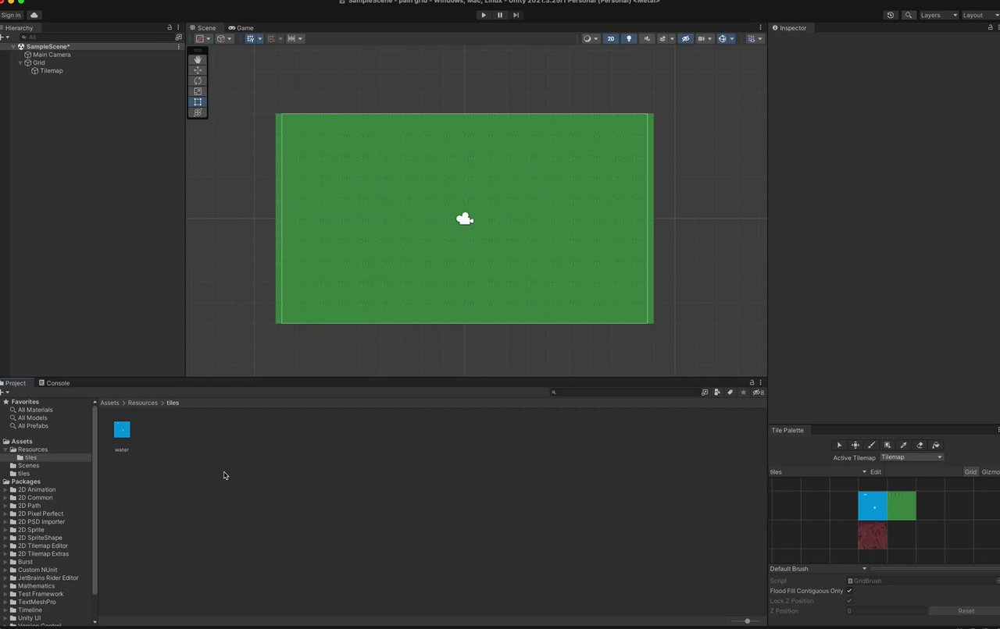

# Drawing With tiles on Tilemap in Unity3d

## Beginning:
Just tiles on tilemap, no drawing.
Here is the loom: https://www.loom.com/share/4d56a8d5534c4138ab1e80a2d58b870b

###  Preview

## Added Zoom and painting with mouse with selected tile brush

Loom: https://www.loom.com/share/5521c0e9003447afa82bfdbdb3a4e367

## Fixed painting with mouse with selected tile brush

Turns out I have duplicated tilemaps and i was painting on a tilemap under another full of tiles.

Also made sure that we are not painting with tile brush if we have a building selected.

Loom: https://www.loom.com/share/5f675eb4ad624ec4aa3fdf79ec1f4d25
